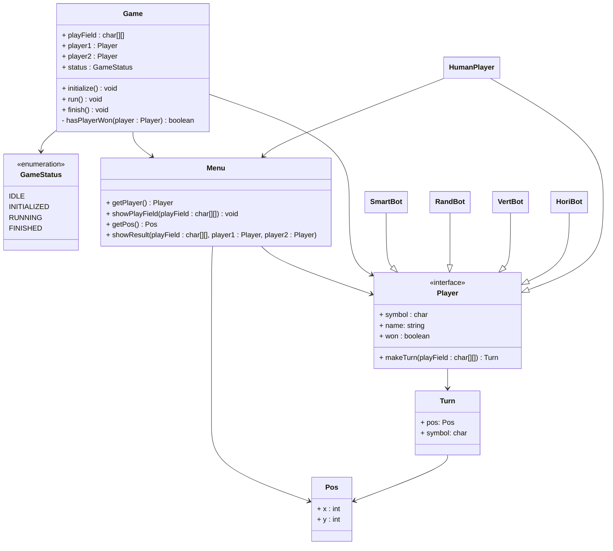

# T4INF1004.2-Programmieren-2-Uebungsprojekt

This repository includes all the C++ code and documentation for the practice projet of my module "T4INF1004.2 Programmieren 2".  Don't take anything here as production ready, but feel free to reach out ;)

## UML-Diagramm

