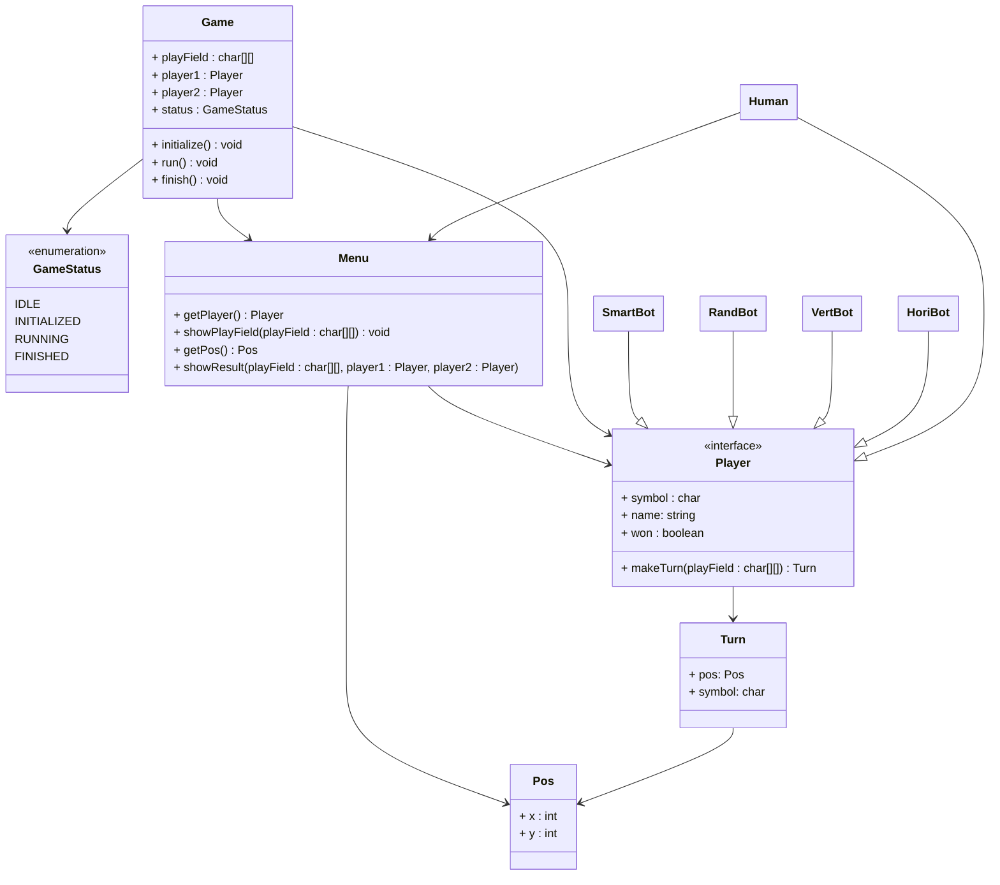

# T4INF1004.2-Programmieren-2-Uebungsprojekt

## UML-Diagramm

```mermaid
---
    config:
        class:
            hideEmptyMembersBox: true
---
classDiagram
	%% Classes
    class Game {
        + playField : char[][]
        + player1 : Player
        + player2 : Player
        + status : GameStatus
        + initialize() void
        + run() void
        + finish() void
    }
    class GameStatus {
        <<enumeration>>
        IDLE
        INITIALIZED
        RUNNING
        FINISHED
    }
    class Player {
        <<interface>>
        + symbol : char
        + name: string
        + won : boolean
        + makeTurn(playField : char[][]) Turn
    }
    class Human
    class HoriBot
    class VertBot
    class RandBot
    class SmartBot
    class Pos {
        + x : int
        + y : int
    }
    class Turn {
        + pos: Pos
        + symbol: char
    }
    class Menu {
        + getPlayer() Player
        + showPlayField(playField : char[][]) void
        + getPos() Pos
        + showResult(playField : char[][], player1 : Player, player2 : Player)
    }
    %% Relationships
    Human --|> Player
    HoriBot  --|> Player
    VertBot --|> Player
    RandBot --|> Player
    SmartBot --|> Player
    Turn --> Pos
    Menu --> Pos
    Player --> Turn
    Human --> Menu
    Game --> Menu
    Game --> GameStatus
    Game --> Player
    Menu --> Player
```
